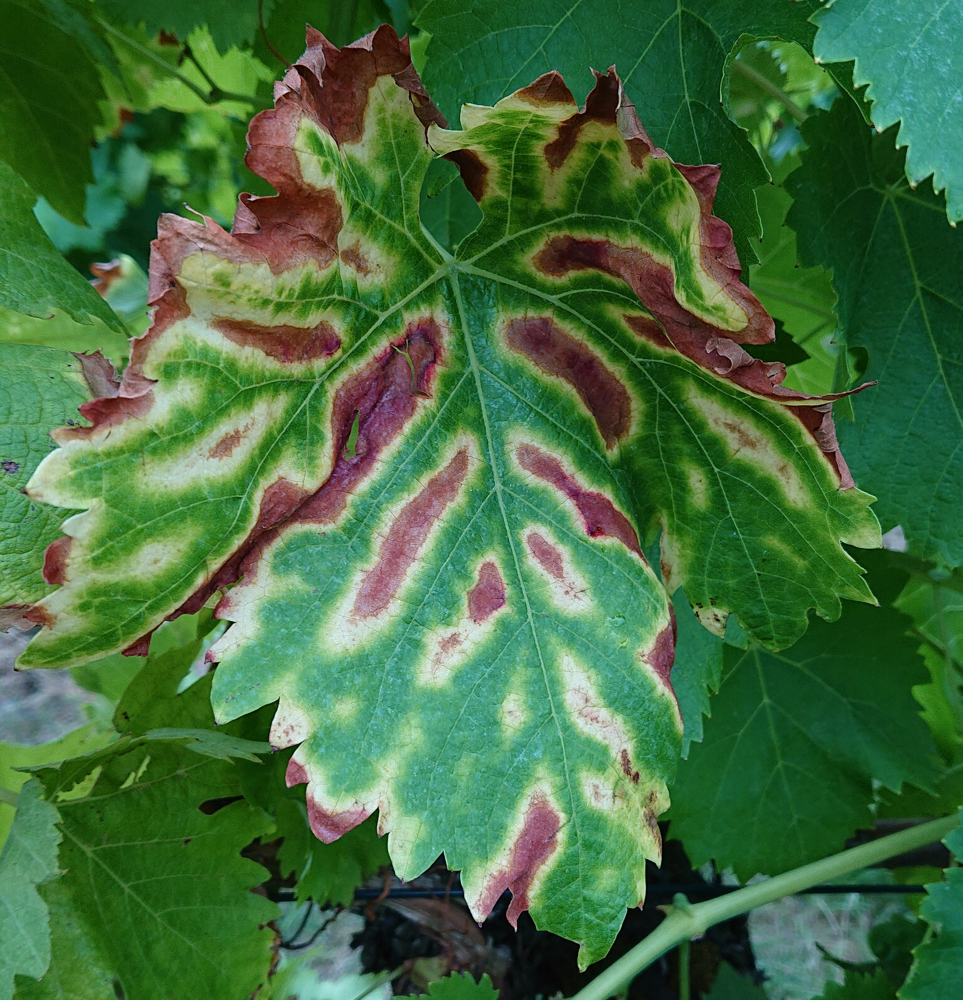

# Different vine leaf diseases

Wir konzentrieren uns zunächst auf die wichtigsten Weinblattkrankheiten. Im Folgenden werden wir genauere Informationen zu den von uns benutzten Krankheiten geben.

1. Echter Mehltau (Erysiphaceae)
2. Falscher Mehltau (Plasmopara viticola)
3. Schwarzholzkrankheit (Bois noir)
4. Esca-Krankheit

## Echter Mehltau

Der echte Mehltau zählt zu den Pilzkrankheiten. Charakteristisch ist der grauweiße Pilzrasen an den Blättern. Folgen, die Trauben stellen ihr Wachstum ein und vertrocknen.  

## Falscher Mehltau

Auch der falsche Mehltau ist eine Pilzkrankheit. Im Gegensatz zum echten Mehltau ist die Blattfärbung bei Erkankung rot. Allerdings gibt es typische "Ölflecken" welche auf den Befall hinweisen.

## Schwarzholzkrankheit
Die ersten Symptome treten ab Juli an der Triebmitte auf. Bei roten Rebsorten werden die Blätter sektor weise lila bis rötlich, weiße Rebsorten verfärben sich hellgrün bis gelblich. Die Blätter rollen sich ein und auch die Blattadern sind von der Verfärbung betroffen.
(Quelle: https://lvwo.landwirtschaft-bw.de/pb/site/pbs-bw-new/get/documents/MLR.LEL/PB5Documents/lvwo/pdf/f/FaltblattSchwarzholz.pdf?attachment=true)

## Esca-Krank
Tigerstreifen als erste Symptome
Wenn sich die Weinblätter schon im Sommer gelb-orange verfärben, kann dies ein erster Hinweis auf die Esca-Krankheit sein. Die Verfärbungen treten zwischen den großen Blattadern auf und bilden mit den grünen Streifen ein typisches Tigerstreifenmuster. Bei Weißweinsorten sind die Blattadern mit einem gelben, bei Rotweinsorten von einem roten Saum umgeben. Später vertrocknen die Blätter und fallen vorzeitig ab. An den Beeren hinterlässt die Esca-Krankheit ähnliche Spuren wie andere pilzliche Krankheiten. Eingeschrumpfte und braun verfärbte Früchte erinnern an die Lederbeeren bei Peronospora-Befall. Ältere Beeren springen auf und zeigen dasselbe Bild wie bei einem Oidium-Samenbruch. Über kurz oder lang vertrocknet alles Grün und der Rebstock stirbt ab.
(Quelle: https://www.iva.de/iva-magazin/forschung-technik/die-esca-krankheit-breitet-sich-aus)

|[The project](https://matheli.github.io/Vine-leaf-diseases-and-AI/) |
