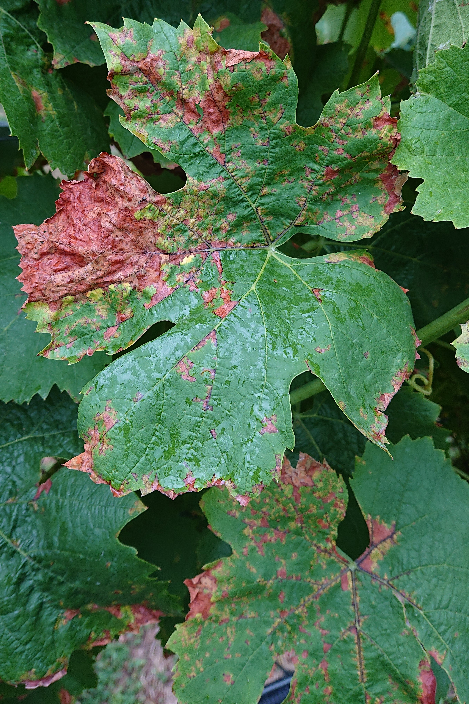
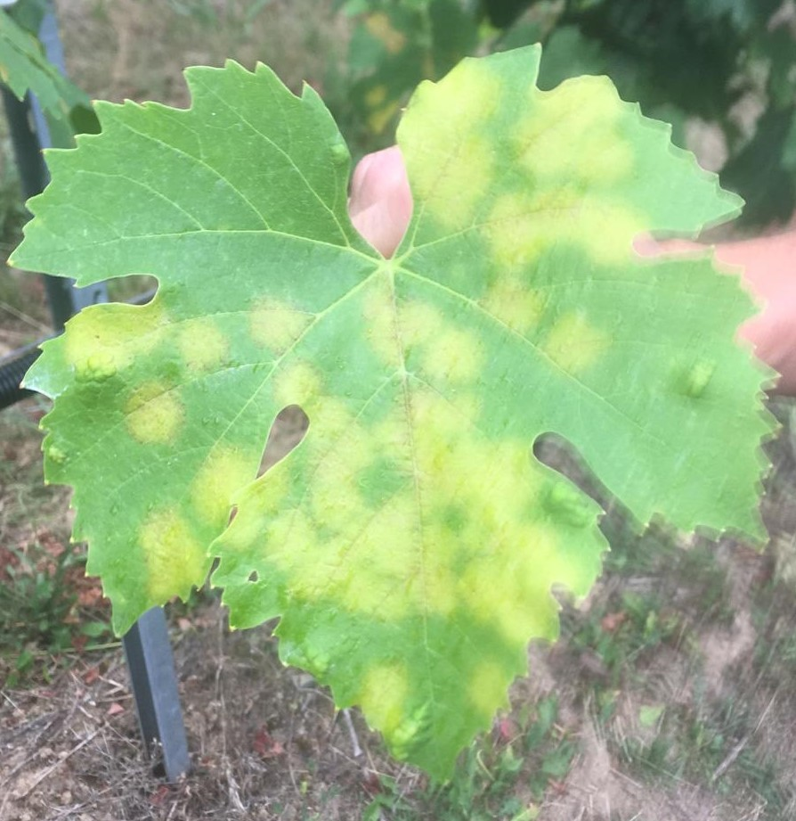
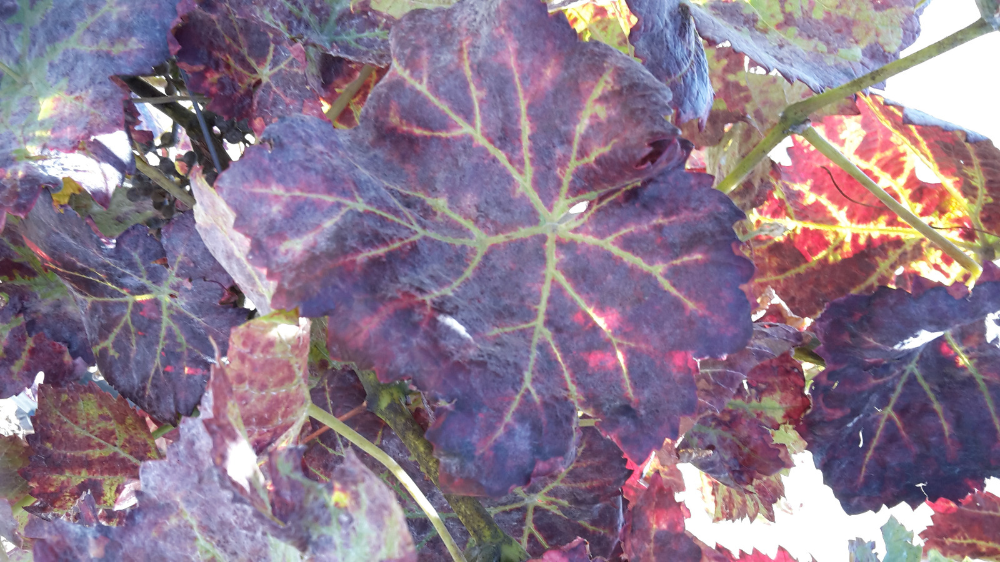
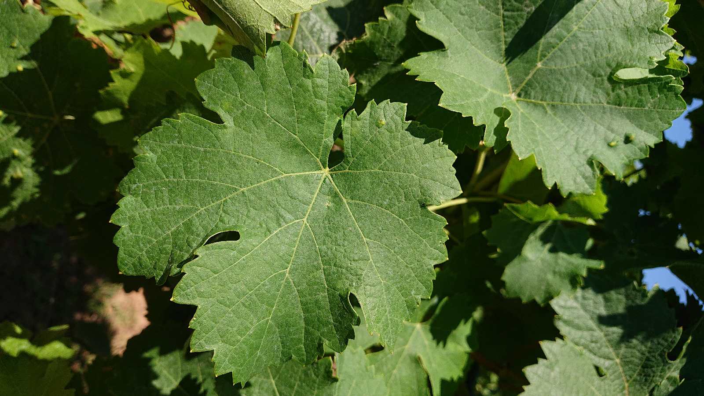

# Different vine leaf diseases

Wir konzentrieren uns zunächst auf die wichtigsten Weinblattkrankheiten. Im Folgenden werden wir genauere Informationen zu den von uns benutzten Krankheiten geben.

1. Echter Mehltau (Erysiphaceae)
2. Falscher Mehltau (Plasmopara viticola)
3. Schwarzholzkrankheit (Bois noir)
4. Esca-Krankheit

Außerdem unterscheidet die KI zusätzlich zwischen:

5. Roter/Gelber Herbstfärbung
6. Gesundes Weinblatt

## Echter Mehltau

Beim Echten Mehltau handelt es sich eine Erkrankung verschiedenen Weinrebarten durch den Erreger „Erysiphe necator“, der zu den sogenannten Schönwetterpilzen gehört. Bekannt ist die Krankheit durch den Schlauchpilz zudem unter den Bezeichnungen Oidium oder Äscherich, was vor allem auf die gräuliche Färbung der Pflanze hinweist, sobald der Befall stark fortgeschritten ist. Der Schlauchpilz befällt den Wein, in dem er sich auf der Oberfläche der Pflanzenteile sammelt und dort über Saugorgane in diese eindringt, genauer gesagt in deren Zellen. Der Pilz greift somit in den Nährstoffhaushalt der Weinrebe ein und wirkt sich negativ auf diesen mit folgenden Symptomen aus:

*   es bilden sich weiß-graue Flecken unter und auf den Blättern
*   ebenso netzartige Strukturen, die an Spinnweben erinnern
*   je stärker die Weinreben befallen sind, desto mehr Pflanzenteile sind betroffen: Triebe, Blüten, Knospen, Trauben
*   die Schicht wirkt mehlig, leicht schimmlig
*   Blätter rollen sich ein
*   Blüten können sich nicht mehr öffnen
*   Trauben werden hart, färben sich grau oder schwarz und erleiden Samenbruch, sind nicht mehr essbar
*   Wachstum wird eingeschränkt
*   Weinrebe geht nach und nach ein
*   spätere Stadien: Flecken färben sich grau-bräunlich

[Quelle](https://www.plantopedia.de/mehltau-am-wein-bekaempfen/)

## Falscher Mehltau
Der Falsche Mehltau wird durch den Erreger „Plasmopara viticola“ ausgelöst, wobei es sich hier um einen sogenannten Schein- oder Eipilz handelt. Sie sind im Vergleich zum Echten Mehltau als Schlechtwetterpilze bekannt und bevorzugen eine feuchte Umgebung. Besonders effektiv ist der Befall, sobald die Nächte feucht sind. Regen ist der beste Überträger aller Mehltaupilze, da dieser allein schon durch das Hochspritzen die Unterseite der Blätter infizieren kann. Im Gegensatz zu Erysiphe necator ernähren sich die Scheinpilze nicht von den Nährstoffen in der Pflanze, sondern befallen die Zellen direkt und erzeugen durch Sporenträger denn charakteristischen Belag. Bei einem Befall entstehen folgende Symptome:
*   weißer, grauer oder leicht violetter mehliger Belag bildet sich an der Blattunterseite
*   Blattoberseite hellt sich auf und bildet Ölflecken
*   Blätter verwelken mit der Zeit
*   Pflanze kann komplett eingehen
*   Lederbeerigkeit, Trauben nicht mehr essbar

[Quelle](https://www.plantopedia.de/mehltau-am-wein-bekaempfen/)

## Schwarzholzkrankheit
Die ersten Symptome treten ab Juli an der Triebmitte auf. Bei roten Rebsorten werden die Blätter sektor weise lila bis rötlich, weiße Rebsorten verfärben sich hellgrün bis gelblich. Die Blätter rollen sich ein und auch die Blattadern sind von der Verfärbung betroffen.
[Quelle](https://lvwo.landwirtschaft-bw.de/pb/site/pbs-bw-new/get/documents/MLR.LEL/PB5Documents/lvwo/pdf/f/FaltblattSchwarzholz.pdf?attachment=true)

## Esca-Krank
Tigerstreifen als erste Symptome
Wenn sich die Weinblätter schon im Sommer gelb-orange verfärben, kann dies ein erster Hinweis auf die Esca-Krankheit sein. Die Verfärbungen treten zwischen den großen Blattadern auf und bilden mit den grünen Streifen ein typisches Tigerstreifenmuster. Bei Weißweinsorten sind die Blattadern mit einem gelben, bei Rotweinsorten von einem roten Saum umgeben. Später vertrocknen die Blätter und fallen vorzeitig ab. An den Beeren hinterlässt die Esca-Krankheit ähnliche Spuren wie andere pilzliche Krankheiten. Eingeschrumpfte und braun verfärbte Früchte erinnern an die Lederbeeren bei Peronospora-Befall. Ältere Beeren springen auf und zeigen dasselbe Bild wie bei einem Oidium-Samenbruch. Über kurz oder lang vertrocknet alles Grün und der Rebstock stirbt ab.
[Quelle](https://www.iva.de/iva-magazin/forschung-technik/die-esca-krankheit-breitet-sich-aus)

## Rote/Gelbe Herbstfärbung

## Gesundes Weinblatt

| [Generelle Projektinformationen](https://matheli.github.io/Vine-leaf-diseases-and-AI/) | [Die verschiedenen Krankheiten](https://matheli.github.io/Vine-leaf-diseases-and-AI/Different-diseases) | [Die App](https://matheli.github.io/Vine-leaf-diseases-and-AI/App) | [Der Code des Modells Teil 1](https://matheli.github.io/Vine-leaf-diseases-and-AI/Code) | [Der Code des Modells Teil 2](https://matheli.github.io/Vine-leaf-diseases-and-AI/Code2) | [Image Preprocessing](https://matheli.github.io/Vine-leaf-diseases-and-AI/ImagePreprocessing) | [Sonstige Informationen](https://matheli.github.io/Vine-leaf-diseases-and-AI/Sonstiges) |
